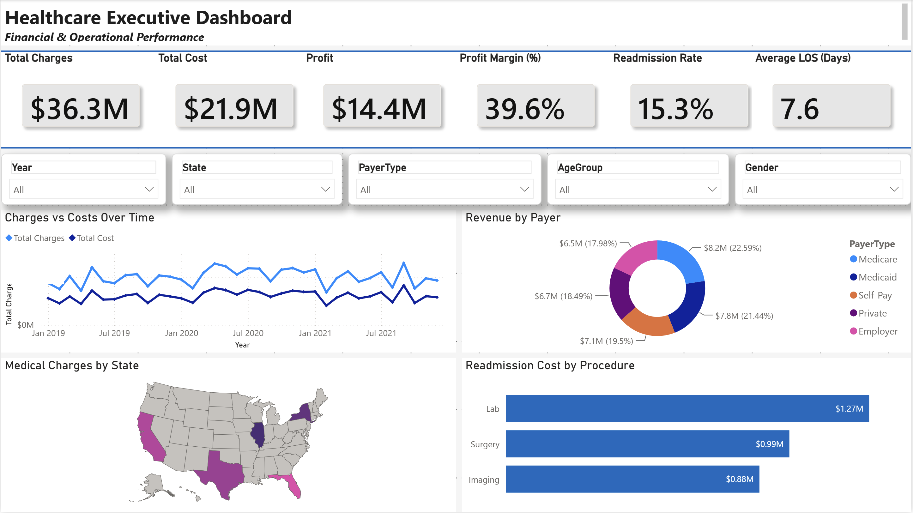
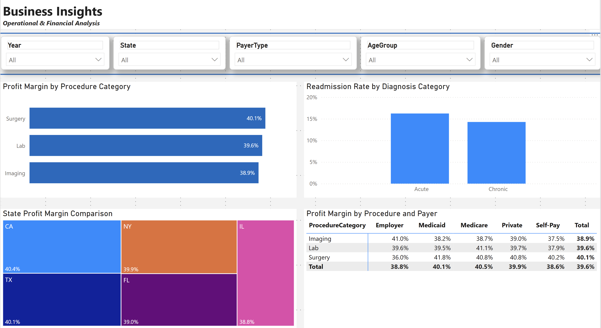
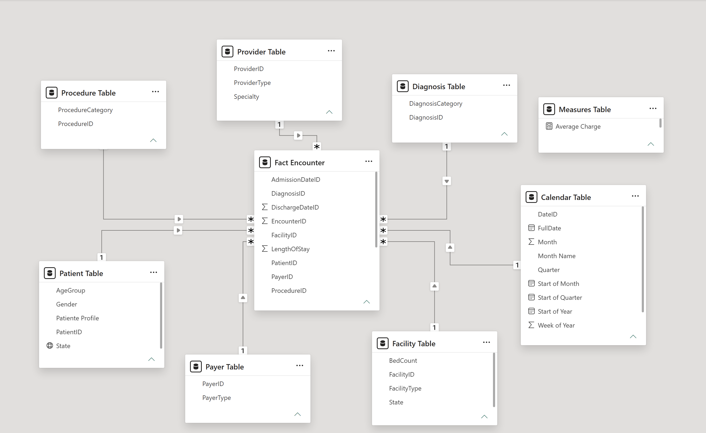

# Healthcare Business Intelligence Dashboard

Interactive Power BI dashboard analyzing healthcare financial and operational performance.

## What This Project Demonstrates

- End-to-end Power BI workflow from data preparation to interactive reporting
- Star Schema dimensional modeling
- DAX measures for financial and operational KPIs
- Data profiling and transformation using Power Query
- Interactive data visualization with slicers and cross-filtering
- Business-oriented analysis of profitability and operational performance

## Dashboard Overview

### Executive Dashboard



Provides a high-level view of:

- Total Charges, Total Cost, Profit, and Profit Margin
- Readmission Rate and Average Length of Stay
- Financial performance over time
- Revenue by payer
- Medical charges by state
- Cost by procedure category

### Business Insights



Provides deeper analysis of:

- Profit Margin by Procedure Category
- Readmission Rate by Diagnosis Category
- Profit Margin by State
- Profit Margin by Procedure and Payer

## Key Insights

### Executive Dashboard

- **Strong financial performance:** Total Charges reached **$36.3M** against **$21.9M** in Total Cost, resulting in **$14.4M in Profit** and an overall **39.6% Profit Margin**.
- **Diversified payer mix:** Revenue was distributed across multiple payer types, with no single payer representing a dominant share of total revenue.
- **Operational performance:** The overall **Readmission Rate was 15.3%**, with an average **Length of Stay of 7.6 days**.
- **Financial trend:** Charges consistently remained above costs throughout the analyzed period, generating positive profit across the reporting period.

### Business Insights

- **Procedure profitability:** Surgery achieved the highest profit margin among the analyzed procedure categories.
- **Geographic performance:** Profit margins varied across states, highlighting differences in financial performance.
- **Readmission patterns:** Readmission rates differed across diagnosis categories.
- **Payer profitability:** Profit margins varied across payer types and procedure categories, allowing more detailed profitability analysis.

## Data Model



The Power BI model follows a Star Schema architecture, with the Fact Encounter table connected to Calendar, Patient, Provider, Facility, Diagnosis, Procedure, and Payer dimensions.

The model uses active one-to-many relationships with single-direction filtering.

## Tools & Skills

**Power BI Desktop · Power Query · DAX · Data Profiling · Star Schema · Dimensional Modeling · Data Visualization · KPI Development · Business Intelligence · Descriptive Analytics**

## Repository Structure

```text
Healthcare-BI-Project/
├── Healthcare-BI-Project.pbix
├── images/
│   ├── executive-dashboard.png
│   ├── business-insights.png
│   └── data-model.png
├── report/
│   └── Healthcare-BI-Project-Report.pdf
└── README.md
```
### How to Explore

Open Healthcare-BI-Project.pbix in Power BI Desktop to interact with the dashboards.

The project report is available in the report/ folder for additional methodology and analysis details.
